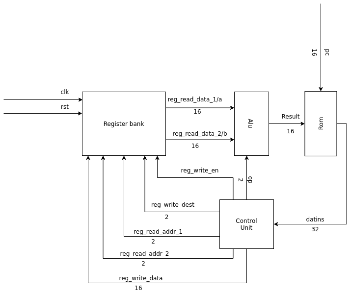
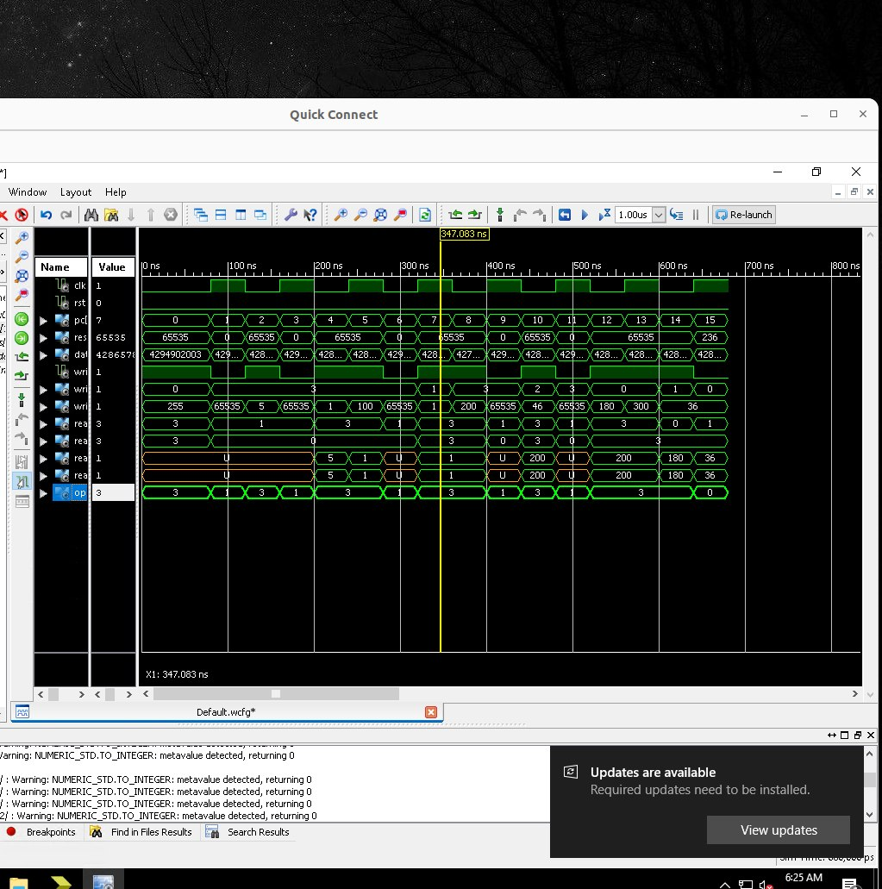
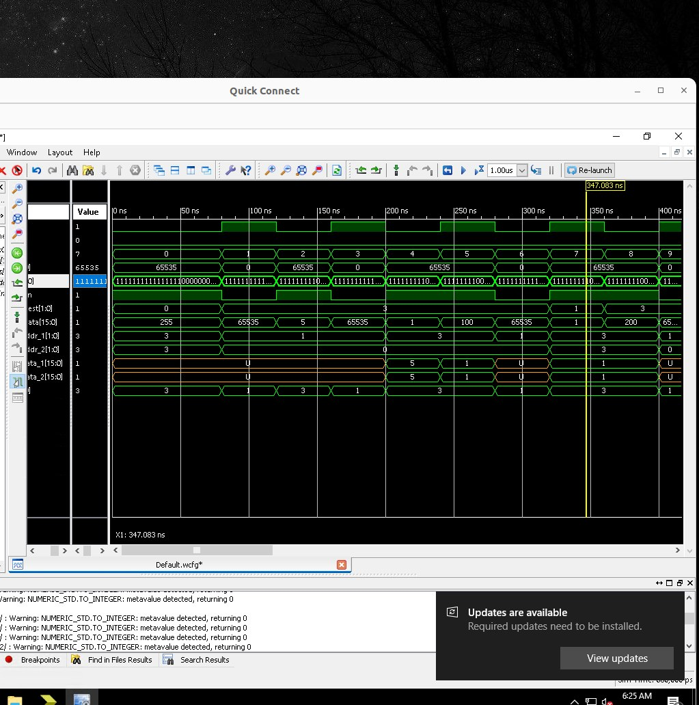

Monkey CPU
===========
This is a simple CPU in [harward design](https://en.wikipedia.org/wiki/Harvard_architecture) format.

Purpose
-------
It's a university training project and the functionality that we want from this cpu is just multiplex two 3x3 matrix and save the result in registry and Ram(in the future!).
This CPU just can add and multiply number and doesnt need any other command according to the project definition.

The whole definition of the project in Farsi is in [this](./media/project-definition.pdf) file.

Schema
------



ISA
---
The instruction are build based in this ISA and stored from Right To Left in the Rom(This must become backward in the next edit!!).

> Type **O** is for I/O commands and type **E** is for executing commands.

> Each `$` represent two bit of register address.
and the `@` means four bit of RAM address.

> `d` represnt 16bit of data.
and each `F` means four dont-carry bit.

| Type  | Function  | OPcode  | ... |
|---|---|---|---|
| E | add | `00` |  `$$$FFFFFF` |
| E | mul | `01` |  `$$$FFFFFF` |
| O | load | `11` | `$FdFF` |
| O | write | `10` |`$@FFFFFF` |


Run
----
We provide the sample code in the `mul.bin` file that tells the cpu to calculate below expression:
```
255*1 + 5*1 + 100*1 + 0*200 + 0*46 + 0*200 + 100*-1 + -1*180 + -1*300 = -220
```
and load lines of this file to the [ROM array](./hardware_description/src/Memory.vhd#17).

### Result in ISE simulation
In the [TestBench](./hardware_description/testbench/monkey_tb.vhd) every `40ns` we send a clock and increase the Program Counter once.

 
